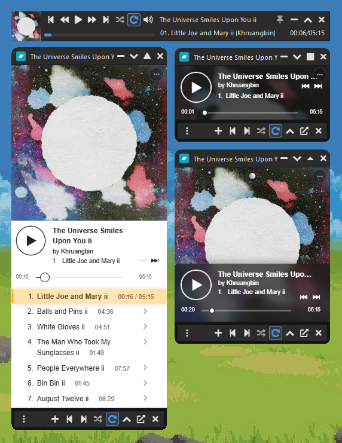
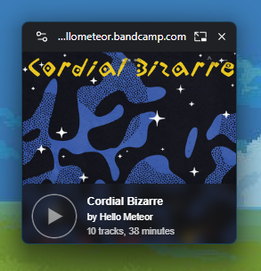

#  Bandcamp Player (Python Edition)

A compact, Python-based mini player for streaming music directly from Bandcamp. Designed for previewing albums and deciding on new music you want to support. This player isn’t meant to replace traditional music software (Winamp, MusicBee, VLC, etc.), but to complement it by making album previews quick and convenient before purchasing, especially when you have a lot of albums to preview.  

## Key Features

* **Executable** - Available in .exe format, simply download and run (compatible with Windows 10 and 11).
* **Automatic Updates** - Select automatic updates or check now to be notified when there is a new update and accept to install it automatically.
* **Compact Interface** - Minimal design that stays out of your way and 4 modes to suit your style: Regular, Mini, Micro, and/or Nano.
* **Playlist Management** - Easily create and manage playlists of your favorite Bandcamp albums.
* **Adjustable Playlist** - Minimize, expand, resize or detach the playlist for flexible window management.
* **Always on Top** - Keep the player visible while working in other applications.
* **Keyboard Shortcuts** - Full keyboard control for play, pause, next, previous, volume, and more (customizable in the settings menu). Global keyboard shortcuts available with included `bandcamp_player_hotkeys.ahk` script ([Autohotkey v2 installation](https://www.autohotkey.com/v2/) required)
* **Autoplay** - Automatically starting playing on startup and when switching albums. 
* **Shuffle & Repeat** - Multiple shuffle and repeat modes for varied listening.
* **Volume Control** - Adjustable volume with visual feedback.
* **Image Viewer** - Zoom and pan the artwork for a better look. 
* **Dark Theme** - Beautiful dark interface that's easy on the eyes.

*The main player interface with compact playlist, regular/mini/micro and nano modes.*

*Note: Mini mode features optional player autohide so the artwork is fully viewable*

*Note: Nano mode features optional autohide when docked to the top or bottom of the screen*

## Technology & Approach

Bandcamp doesn’t provide a public API for music playback, playlists, or track data (its official APIs are limited to sales and merchandise for artists and labels). 

As a work around Bandcamp Player embeds a customized version of Bandcamp's mobile webview in a desktop app, preserving the Bandcamp experience while adding lightweight desktop features.

### Core Stack

- **PyQt6** – Cross-platform desktop framework for window management
- **PyQt6-WebEngine** – Embedded Chromium browser used to load Bandcamp’s mobile site with full DOM access  
- **QtAwesome** – FontAwesome icons
  
## Quick Start

**Installation**

1. Download [BandcampPlayer.exe](https://github.com/kameryn1811/Bandcamp-Player/releases/tag/Launcher_v1.0.0) and run it! (everything else is automatic)
2. **Note:** You may see a Windows Defender SmartScreen Warning, see [Troubleshooting](#troubleshooting) for more information. 
3. What it Does:
   - Downloads the latest `bandcamp_pl_gui.py` script from GitHub and Launches it
   - Checks for updates on startup
   - Self-contained - No Python installation needed
   - Automatically installs any dependencies

## Usage

1. **Add URLs**: Drag and drop or Paste Bandcamp URLs into the main window (to load it right away) or into the playlist (to create a queue).
2. **Play Music**: Double click on an album in the playlist to load the url and start playing.
3. **Track Controls**: Use the bandcamp play controls or keyboard shortcuts to navigate tracks.
4. **Playlist Controls**: Use the Playlist controls to navigate albums and playback modes or adjust the playlist size or position.
5. **Window Modes**: Switch between Regular, Mini, Micro, and Nano modes from the title bar.
6. **Playlists**: Create multiple playlists and switch between them using the playlist menu.

## Shuffle & Repeat Modes  

 **Shuffle Tracks** – shuffle tracks within the current album  
 **Shuffle Albums** – play albums in random order  
 **Super Shuffle** – completely random tracks and albums; avoids recent repeats  
 **Continuous Repeat** – plays through entire playlist (default)  
 **Repeat Album** – loops current album  
 **Repeat Track** – loops current track (shows "1" on button)  

**Combinations:** Shuffle and Repeat work together (e.g., *Shuffle Tracks + Repeat Album* loops shuffled tracks; *Super Shuffle + Repeat Off* plays random tracks without immediate repeats).

## Keyboard Shortcuts

* **Space** - Play/Pause
* **Play/Pause** - Ctrl + Alt + Space
* **Next Track** - Ctrl + Alt + Right
* **Previous Track** - Ctrl + Alt + Left
* **Next Album** - Ctrl + Shift + Alt + Right
* **Previous Album** - Ctrl + Shift + Alt + Left
* **Volume Up** - Ctrl + Shift + Up
* **Volume Down** - Ctrl + Shift + Down
* **Mute** - Ctrl + Shift + M
* **Toggle Playlist** - Ctrl + Alt + P
* **Expand/Collapse Playlist** - Ctrl + Shift + Alt + P
* **Cycle App Mode** - Ctrl + Alt + M
* **Save Playlist** - Ctrl + S
* And more... (see Settings > Keyboard Shortcuts)
* Note: Global keyboard shortcuts require ([Autohotkey v2](https://www.autohotkey.com/v2/) to be installed and the included `bandcamp_player_hotkeys.ahk` script to be running. 

## Troubleshooting

**Please Note**
- Documentation is still improving
- There will be dragons/bugs, feel free to report any issues, this should be a stable release but there are some bugs. To resolve them you can try: loading another url, restarting the app, and if you're stuck rename or delete settings.json and/or Playlists folder to do a factory reset.

**Windows SmartScreen Warning**
- When you open BandcampPlayer.exe for the first time, Windows might say: "Windows protected your PC"
- This happens because the app isn't code-signed (certificates are pricey, and this is a free open-source project).
- No worries, it's safe to run. The EXE is the same code you can read on GitHub.
- **To continue:** Click "More info" and "Run anyway", Windows won't nag you again for the same .exe. 
- **Want extra peace of mind?** - You can review the code, build it yourself, or use the standalone Python script like in Option 2.

**"Python not found"**
- Reinstall Python and ensure "Add Python to PATH" is checked
- Or manually add Python to your system PATH

**Windows 7: Missing DLL or Failed to load Python Errors**
- If the app won't launch on Windows 7 and you see errors like "api-ms-win-core-path-l1-1-0.dll not found" or "Failed to load Python DLL," Windows 7 is missing a DLL required by Python 3.11+.
- Fix it with the latest compatibility patch from nalexandru: https://github.com/nalexandru/api-ms-win-core-path-HACK/releases
- Download the latest release and copy the DLLs to the following locations:
  - x86 → C:\Windows\SysWOW64
  - x64 → C:\Windows\System32 (Admin rights may be needed)
- Launch the app!
- Thanks to @alabx for this [fix](https://github.com/kameryn1811/Bandcamp-Downloader/issues/6)! 

**"Player not responding or sluggish"**
- Check your internet connection
- Verify the Bandcamp URL is valid and accessible
- Try refreshing the page
- VPNs, proxies, or ISP “secure connection” features can block or slow the CDN requests used to fetch artwork and metadata. Try turning these off or switching to a faster VPN location.
- Antivirus software with HTTPS/SSL scanning (Kaspersky, ESET, Dr.Web, etc.) may interfere with image requests — temporarily disable these features to test.If it helps, whitelist BandcampDownloader.exe and bandcamp.com.
- Bad DNS routing can also cause slow or missing images. Switching to 1.1.1.1, 8.8.8.8, or 9.9.9.9 may help.

**"Playlist not saving"**
- Check that the Playlists folder exists in the app directory
- Verify write permissions for the app directory

**Global Keyboard Shortcuts not working**
- Global keyboard shortcuts require ([Autohotkey v2](https://www.autohotkey.com/v2/) to be installed and the included `bandcamp_player_hotkeys.ahk` script to be running. 
- Try restarting the application

## Credits & Inspiration

This project was inspired by [Robert Golderbine's Companion Window | Always on Top](https://chromewebstore.google.com/detail/companion-window-always-o/hhneckfekhpegclkfhefepcjmcnmnpae) and [Yuki Eliot's Mobile View Switcher](https://chromewebstore.google.com/detail/mobile-view-switcher/ddfcjnekgmblacbpifjdmcbbhfcdekic). Prior to this project I was using a modified version of these Browser Extenstions to achieve a Mini BandCamp Player (It featured a compact bandcamp mode that stripped away everything but the player and playlist, and had 3 view modes - but needed to be launched for each album individually and sadly had many security limitations preventing automations e.g. resizing and playback manipulation which are inherent in browser PIP implementations).

*Original Bandcamp Player using a modified version of Companion Window in combination with Mobile View Switcher:*

## Legal & Ethical Use

This tool is designed for:
* Streaming freely available music from Bandcamp
* Personal use of music you own or have permission to stream
* Building a local playlist of your favorite Bandcamp content

Please respect copyright laws and Bandcamp's terms of service. Support artists by purchasing music when possible.

## Disclaimer

This software is provided as-is for educational and personal use. The developers are not responsible for misuse. Please use responsibly and support the artists whose music you enjoy.

